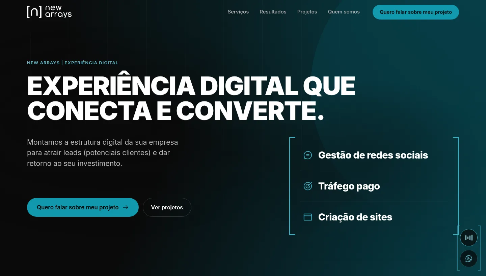

<div align="center">

# `[n]` New Arrays

### Experiência digital que conecta e converte.

**[newarrays.com →](https://newarrays.com)**


</div>



## Sobre

Site institucional da **New Arrays**, agência de experiência digital de Embu das Artes (SP) que atende empresas de todo o Brasil.

A agência monta a estrutura digital de que uma empresa precisa para crescer:

- **Gestão de redes sociais:** perfil organizado e ativo, com conteúdo que gera confiança.
- **Tráfego pago:** anúncios que levam a oferta a quem tem interesse e trazem leads todos os meses.
- **Criação de sites:** sites sob medida que apresentam a empresa e transformam visitas em contatos.

O site foi pensado como **ferramenta comercial**. Em poucos segundos a pessoa entende o que a agência faz, vê trabalhos reais e começa uma conversa sem sair da página.


## Destaques

- **Formulário que nasce do botão.** O "Quero falar sobre meu projeto" se transforma num formulário de 4 etapas ali mesmo no topo. Cada lead chega por e-mail e cai numa planilha do Google, com a origem da visita (UTMs).
- **Abertura em cena.** Ao rolar, o topo da página dá lugar aos três pilares da agência, com os colchetes da marca viajando entre as duas telas.
- **Trabalhos reais, não imagens genéricas.** Reels e carrosséis de clientes tocam sozinhos quando aparecem. Os vídeos de resultados têm som sob demanda, e a música do site dá licença enquanto isso.
- **Fumaça em WebGL.** Uma simulação de fluido feita do zero ocupa o fundo do topo e reage ao cursor.
- **Fluxo de campanhas interativo.** É um mapa que mostra o caminho de um lead, do anúncio até a reunião.
- **Do código à marca.** Na seção de origem, um notebook abre com a rolagem e caracteres `[ ] { } 0 1` se juntam até formar a marca. Em "Quem somos", a foto do fundador vira pixels que montam o logo.
- **Detalhes de interface.** Há trilha sonora com controle no canto, sons sutis de navegação, hovers diferentes para cada contexto e um loader animado com o SVG da marca.

## Feito com cuidado

| | |
|---|---|
| **Sem build** | HTML, CSS e JavaScript puro, sem framework, sem `npm install` para rodar |
| **Desempenho** | Mídia só carrega quando aparece na tela; imagens em WebP com `srcset`; vídeos comprimidos |
| **Acessibilidade** | Navegação por teclado, textos para leitores de tela e respeito ao "reduzir movimento" do sistema |
| **Responsivo** | Experiência própria para celular, tablet e notebook, não só "encolhida" |
| **Formulário seguro** | Validação no navegador e no servidor, proteção contra spam e envios repetidos, senhas fora da pasta pública |

**Tecnologias:** [GSAP](https://gsap.com) + ScrollTrigger, [Lenis](https://lenis.darkroom.engineering), WebGL, Canvas 2D, Web Audio, [PHPMailer](https://github.com/PHPMailer/PHPMailer) e Google Apps Script.

## Rodar localmente

```bash
git clone https://github.com/AlexandreGarciaJr/website-new-arrays.git
cd website-new-arrays
php -S localhost:8000
```

Abra **http://localhost:8000**. Para o formulário enviar de verdade, copie `api/config.exemplo.php` para `api/config.php` e preencha os dados. O passo a passo completo está em [`integracao/INTEGRACAO-FORMULARIO.md`](integracao/INTEGRACAO-FORMULARIO.md).

## Estrutura

```
├── index.html              página única
├── assets/
│   ├── css/site.css        estilos
│   ├── js/                 cenas, animações, formulário, mídia e sons
│   ├── midia/              vídeos e posts reais dos clientes
│   ├── video/              quadros da animação do notebook
│   ├── img/                logos, ícones e prints dos projetos
│   ├── audio/              trilha sonora
│   └── fonts/              Inter variável
├── api/                    envio do formulário (e-mail + planilha)
├── integracao/             código da planilha e guia de configuração
└── TECNICO.md              manual técnico e de manutenção
```

---

<div align="center">

**[newarrays.com](https://newarrays.com)** · Embu das Artes, SP

Desenvolvido por [Alexandre Garcia](https://github.com/AlexandreGarciaJr)

</div>